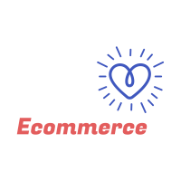

  

### 
¡Hola 👋, gracias por venir a mi Github!
 

 

## Sobre mí  
Soy una persona curiosa, que le gusta estar siempre investigando, autodidacta ..., pero tengo que admitir que donde esté un buen equipo en el que todos aprendamos, me siento muy cómodo

Empecé en este mundillo cuando tenía unos 21 años, en un Ciclo de Grado Superior de Telecomunicaciones en Informática, donde ví C++, pero por capricho de la vida, mi camino no fue el de la programación, aunque siempre se quedó dentro de mí el no poder dedicarme a ello.

Terminé un Ciclo Superior de Desarrollo de Aplicaciones Multiplataformas, el cual se ha centrado en adquirir conocimientos en lenguaje como Java, en base de datos SQL o framework como Android, al terminar he podido realizar las prácticas de empresa en Lean Mind .

Para introducirme en Frontend he realizado varios cursos y un bootcamp donde he podido adquirir conocimientos de JavaScript, TypeScript, Angular, HTML5, CSS3 y React .  

 

 ## Algo más  
- 🔭 Soy desarrollador voluntario en [AdoptaUnJunior](https://adoptaunjunior.es/) y en <strong> Kimox Studio </strong>
   

- 🌱 Actualmente estoy aprendiendo Jest y Nextjs, para poder expandir algo más mis conocimientos 
 

- 🌐<a href="https://samuelromeroarbelo.com" alt="Web personal" target="_blank">Web Personal</a>

   

 ## Algunos Proyectos 
 
<table>
	<tr>
	  <th>My_Whatsapp_Clone</th>
	  <th>Your Multiply</th>
    <th>Movies for World</th>
    <th>Ecommerce</th>
   	</tr>
 	<tr>
  	<td width="25%">
        
  
        
        

    </td>
    <td width="25%">
        
  
        
        

    </td>
    <td width="25%">
        
  
        
        

      </td>
    <td width="25%">
        
  
        
        

    </td>
   	</tr>
		<tr>
  		<td width="25%">
        
Repositorio <a href="https://github.com/Oiranca/whatsapp-clone" target="_blank">My Whatsapp clone</a>

      </td>
      <td width="25%">
        
Repositorio <a href="https://github.com/Oiranca/multiply-game" target="_blank">Multiply</a>

      </td>
      <td width="25%">
        
Repositorio <a href="https://github.com/Oiranca/movies_for_world" target="_blank">Movies For World</a>

      </td>
      <td width="25%">
        
Repositorio <a href="https://github.com/Oiranca/ecommerce-backend" target="_blank">Ecommerce</a>

      </td>
    	</tr>
</table>

   

 ## Colaboraciones 
 
<table>
	<tr>
	<th>Mymedesp</th>
	<th>Chraracters Vault</th>
  <th>AdoptaUnJunior</th>
  <th>KnitsDigital</th>
   	</tr>
 	<tr>
  	<td width="25%">
        
  
        
        

     </td>
   
   <td width="25%">
        
  
        
        

    </td>
    <td width="25%">
        
  
        
        

     </td>
    <td width="25%">
        
  
        
        

	  </td>
   	</tr>
		<tr>
  		<td width="25%">
        
Deploy <a href="https://mymedesp.com/" target="_blank">Mymedesp</a>

      </td>
      <td width="25%">
        
Deploy <a href="https://charactersvault.com/" target="_blank">Characters Vault</a>

      </td>
      <td width="25%">
        
Deploy <a href="https://adoptaunjunior.es/" target="_blank">AdoptaUnJunior</a>

      </td>
      <td width="25%">
        
Deploy <a href="https://www.knitsdigital.es/" target="_blank">KnitsDigital</a>

      </td>
    	</tr>
</table>

   

## Mis Skills   

<table>
<tr>
<td align="center" width="96">

 <b>React</b>
</td>
<td align="center" width="96">

 <b>CSS3</b>
</td>
<td align="center" width="96">

 <b>HTML5</b>
</td>
<td align="center" width="96">

 <b>JavaScript</b>
</td>
<td align="center" width="96">

 <b>TypeScript</b>
</td>
<td align="center" width="96">

 <b>NextJS</b>
</td>
<td align="center" width="96">

 <b>Tailwind</b>
</td>

<td align="center" width="96">

 <b>React Testing</b>
</td>
</tr>
</table>

<table>
<tr>
<td align="center" width="96">

 <b>MySQL</b>
</td>
<td align="center" width="96">

 <b>PostgreSQL</b>
</td>

<td align="center" width="96">

 <b>Java</b>
</td>
<td align="center" width="96">

 <b>Node.js</b>
</td>
<td align="center" width="96">

 <b>Jest</b>
</td>
<td align="center" width="96">

 <b>Git</b>
</td>
<td align="center" width="96">

 <b>VS Code</b>
</td>
<td align="center" width="96">

 <b>Cursor</b>
</td>
</tr>
</table>
   

## Oiranca's GitHub Stats  

> Generate visualizations of GitHub user and repository statistics using GitHub
Actions.

> NOTE: This repository is my extension of the repo [jstrieb/github-stats](https://github.com/jstrieb/github-stats). This repo was meant to serve as a detached fork of his project. If you like this repository make sure you also star his repository to show appreciation for his work. 

  

## Redes Sociales  

    

  

----
  
Generado con <a href="https://profilinator.rishav.dev/" target="_blank">Github Profilinator</a>

